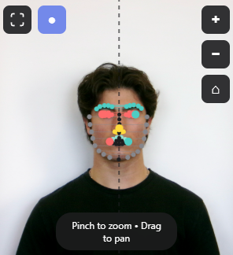

# Face Symmetry Analyzer

A lightweight web application that analyzes facial symmetry from uploaded photos. All processing happens locally in your browser - no images are uploaded or stored.

## Features

- **Image Upload**: Accept JPG/PNG images via click or drag-and-drop
- **Face Detection**: Automatically detects faces using face-api.js
- **Symmetry Analysis**: Calculates a 0-100 symmetry score based on facial landmarks
- **Visual Overlay**: Displays midline and landmark points to show how the score was calculated
- **Privacy-First**: All processing happens client-side - no server, no storage

## How to Use

1. Open `index.html` in a modern web browser (Chrome, Firefox, Edge, Safari)
   - **Quick test:** Double-click `index.html` to open it
   - **Recommended:** Use a local server (see [TESTING.md](TESTING.md) for details)
2. Click the upload area or drag and drop a face photo
3. Wait for the analysis (usually takes 2-5 seconds)
4. View your symmetry score and visual overlay
5. Click "Analyze Another Photo" to try again

For detailed testing instructions, see [TESTING.md](TESTING.md).

## Technical Details

- **Tech Stack**: HTML5, CSS3, JavaScript (ES6+)
- **Face Detection**: face-api.js (TinyFaceDetector + 68-point landmarks)
- **Symmetry Algorithm**: 
  - Calculates vertical midline from nose tip and chin
  - Mirrors key landmarks across midline
  - Computes average deviation normalized by face width
  - Converts to 0-100 score

## Browser Requirements

- Modern browser with JavaScript enabled
- Internet connection (for loading face-api.js models on first use)
- WebAssembly support (available in all modern browsers)

## Privacy

All image processing happens entirely in your browser. No images are uploaded to any server, and no data is stored. The face detection models are loaded from CDN but run locally.

## License

See LICENSE file for details.
